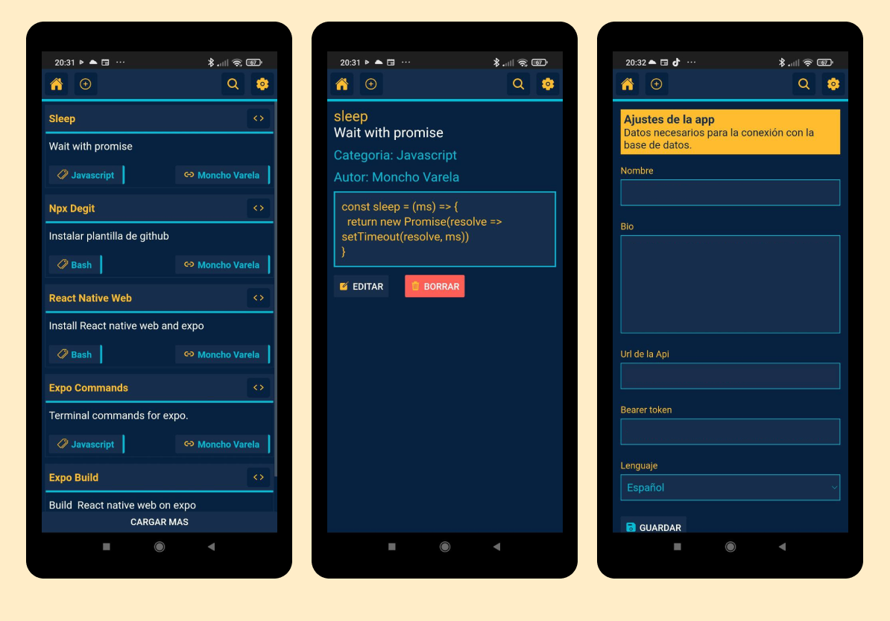

# Info

Este es un proyecto personal para tener una base de datos de codigos.
Usa como api php que esta en api_php y que se conecta a una base de datos mysql.

## Capturas de la app

### Instalación

    yarn install o npm install

### Edición 

    yarn start o yarn web

Para crear un build de de la app en web usar `expo build:web`.

